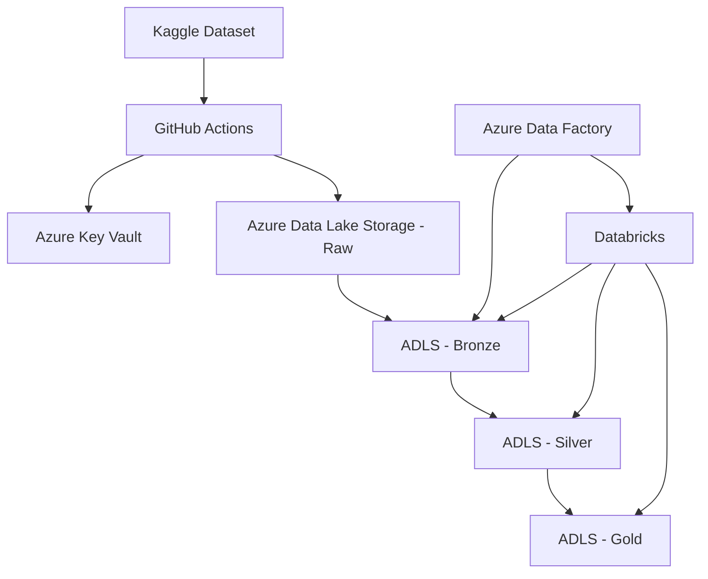

# 🚀 Data Ingester ADB - Pipeline de Ingesta de Datos

[](https://python.org)
[](https://azure.microsoft.com/services/data-factory/)
[](https://databricks.com/)
[](https://github.com/features/actions)

Sistema completo de ingesta y transformación de datos que automatiza la extracción de datasets desde Kaggle hacia Azure Data Lake Storage (ADLS) y su posterior procesamiento a través de una arquitectura medallion (Bronze-Silver-Gold) usando Azure Data Factory y Databricks.

## 📋 Tabla de Contenidos

- [🏗️ Arquitectura](#-arquitectura)
- [✨ Características](#-características)
- [🔧 Componentes](#-componentes)
- [⚙️ Configuración](#-configuración)
- [🚀 Uso](#-uso)
- [📊 Pipeline de Datos](#-pipeline-de-datos)
- [📔 Transformaciones de Databricks](#-transformaciones-de-databricks)
- [🔒 Seguridad](#-seguridad)
- [📁 Estructura del Proyecto](#-estructura-del-proyecto)
- [🤝 Contribución](#-contribución)

## 🏗️ Arquitectura

Este proyecto implementa una arquitectura moderna de ingesta de datos con los siguientes componentes:



## ✨ Características

- **🔄 Ingesta Automatizada**: Extracción de datasets desde Kaggle mediante GitHub Actions
- **☁️ Almacenamiento en la Nube**: Integración completa con Azure Data Lake Storage
- **🏗️ Arquitectura Medallion**: Procesamiento de datos en capas Bronze, Silver y Gold
- **🔒 Gestión Segura de Credenciales**: Uso de Azure Key Vault para secrets
- **📊 Orquestación**: Azure Data Factory para coordinación de pipelines
- **⚡ Procesamiento Escalable**: Databricks para transformaciones complejas
- **🎯 Formatos Optimizados**: Conversión automática de Excel/CSV a Parquet

## 🔧 Componentes

### 1. Kaggle Ingester (`kaggle-ingester/`)
Script principal en Python que:
- Descarga datasets desde Kaggle API
- Convierte archivos Excel a CSV
- Sube archivos a Azure Data Lake Storage
- Gestiona credenciales de forma segura

### 2. GitHub Actions Workflow (`.github/workflows/`)
Automatización CI/CD que:
- Se ejecuta mediante workflow_dispatch
- Configura el entorno Python
- Ejecuta el ingester con parámetros
- Maneja autenticación con Azure

### 3. Azure Data Factory Pipeline (`Data-Ingester-Pipeline/`)
Orquestador que:
- Dispara GitHub Actions via API
- Mueve datos de Raw a Bronze (CSV → Parquet)
- Ejecuta notebooks de Databricks
- Limpia archivos temporales

### 4. Notebooks de Databricks (`transformation/`)
Notebooks de PySpark y SQL para procesamiento de datos:
- **Bronze**: Ingesta inicial con timestamps
- **Silver**: Limpieza, tipado y enriquecimiento
- **Gold**: Agregaciones y métricas de negocio
- **Seguridad**: DDLs y gestión de permisos
- **Rollback**: Scripts de limpieza y recuperación

## ⚙️ Configuración

### Prerrequisitos

- **Azure Subscription** con los siguientes servicios:
  - Azure Data Factory
  - Azure Data Lake Storage Gen2
  - Azure Key Vault
  - Azure Databricks
- **GitHub Repository** con Actions habilitadas
- **Kaggle Account** con API credentials

### Variables de Entorno y Secrets

#### Azure Key Vault Secrets:
```bash
kaggle-username    # Tu username de Kaggle
kaggle-key        # Tu API key de Kaggle
github-token      # Personal Access Token de GitHub
```

#### GitHub Repository Secrets:
```bash
AZURE_CREDENTIALS  # Service Principal JSON
KEYVAULT_URI      # https://tu-keyvault.vault.azure.net/
STORAGE_ACCOUNT   # Nombre de tu storage account
```

### Instalación Local

1. **Clonar el repositorio:**
   ```bash
   git clone https://github.com/gquintal/data-ingester-adb.git
   cd data-ingester-adb
   ```

2. **Crear entorno virtual:**
   ```bash
   python -m venv venv
   source venv/bin/activate  # En Windows: venv\Scripts\activate
   ```

3. **Instalar dependencias:**
   ```bash
   pip install -r kaggle-ingester/requirements.txt
   ```

## 🚀 Uso

### Ejecución Manual via GitHub Actions

1. Ve a la pestaña **Actions** en tu repositorio
2. Selecciona **🔄 Kaggle to ADLS Ingester**
3. Haz clic en **Run workflow**
4. Especifica los parámetros:
   - **Dataset**: `username/dataset-name` (ej: `jillanisofttech/flight-price-prediction-dataset`)
   - **Container**: `raw` (o el nombre de tu contenedor)

### Ejecución via Azure Data Factory

1. Abre tu instancia de Azure Data Factory
2. Navega al pipeline **Data Ingester Smart Data**
3. Ejecuta con parámetros:
   ```json
   {
     "dataset": "jillanisofttech/flight-price-prediction-dataset",
     "container_name": "raw"
   }
   ```

### Ejecución Local (Desarrollo)

```bash
python kaggle-ingester/kaggle-ingester.py \
  --dataset "username/dataset-name" \
  --keyvault-uri "https://tu-keyvault.vault.azure.net/" \
  --storage-account "tu-storage-account" \
  --container "raw"
```

## 📊 Pipeline de Datos

El pipeline sigue una arquitectura medallion con las siguientes etapas:

### 🥉 Raw Layer
- **Formato**: CSV/Excel originales
- **Propósito**: Datos crudos sin procesamiento
- **Ubicación**: `container/raw/`

### 🥉 Bronze Layer
- **Propósito**: Datos estructurados, sin transformaciones
- **Procesamiento**: Conversión de formato, validación básica
- **Ubicación**: `container/bronze/`

### 🥈 Silver Layer
- **Propósito**: Datos limpios y estandarizados
- **Procesamiento**: Limpieza, deduplicación, tipado
- **Ubicación**: `container/silver/`

### 🥇 Gold Layer
- **Propósito**: Datos listos para análisis
- **Procesamiento**: Agregaciones, métricas de negocio
- **Ubicación**: `container/gold/`

## 📔 Transformaciones de Databricks

### 🥉 Bronze Layer (`extraction to bronze.py`)
**Objetivo**: Ingesta inicial de datos con metadatos
```python
# Principales operaciones:
- Lectura de archivos Parquet desde ADLS
- Agregado de timestamp de ingesta
- Escritura en formato Delta Lake
```

### 🥈 Silver Layer (`transform to silver.py`)
**Objetivo**: Limpieza y estandarización de datos
```python
# Transformaciones aplicadas:
- Eliminación de duplicados
- Conversión de tipos de datos (fechas, decimales)
- Parsing de duración de vuelos a minutos
- Estandarización de Total_Stops (texto → números)
- Identificación de vuelos directos
- Validación y limpieza de campos
```

**Campos procesados**:
- `Date_of_Journey`: Conversión a formato DATE
- `Duration`: Parsing a `Duration_Minutes` (entero)
- `Total_Stops`: Normalización de texto a números
- `Price`: Conversión a DECIMAL(10,2)
- `Is_Direct_Flight`: Flag booleano para vuelos sin escalas

### 🥇 Gold Layer (`load to gold.py`)
**Objetivo**: Creación de métricas de negocio y dimensiones analíticas

#### Tabla `dim_airlines`:
```sql
-- Métricas por aerolínea:
- total_flights: Cantidad total de vuelos
- avg_price: Precio promedio
- most_common_route: Ruta más frecuente
- direct_flights_percentage: % de vuelos directos
- avg_stops: Promedio de escalas
```

#### Tabla `dim_routes`:
```sql
-- Métricas por ruta:
- total_flights: Vuelos en la ruta
- avg_price, min_price, max_price: Estadísticas de precios
- median_price: Mediana de precios
- avg_stops: Escalas promedio
- airlines_count: Aerolíneas que operan la ruta
```

### 🔧 Gestión de Esquemas (`DDLs.sql`)
**Configuración inicial de la base de datos**:
- Creación del catálogo
- Definición de esquemas: `bronze`, `silver`, `gold`
- Configuración de tablas Delta con ubicaciones ADLS
- Gestión de permisos para usuarios

### 🧹 Rollback (`Drop.sql`)
**Scripts de limpieza y recuperación**:
- Eliminación de tablas Delta
- Limpieza de archivos en ADLS
- Recuperación de external locations
- Procedimientos de rollback para desarrollo/testing

## 🔒 Seguridad

- **🔐 Azure Key Vault**: Almacenamiento seguro de credenciales
- **🛡️ Managed Identity**: Autenticación sin credenciales hardcodeadas
- **🔒 GitHub Secrets**: Variables sensibles encriptadas
- **🚫 .gitignore**: Exclusión de archivos temporales y credenciales
- **✅ Principio de menor privilegio**: Permisos mínimos necesarios

## 📁 Estructura del Proyecto

```
data-ingester-adb/
├── 📂 .github/workflows/
│   └── kaggle-ingest.yml          # GitHub Actions workflow
├── 📂 kaggle-ingester/
│   ├── kaggle-ingester.py         # Script principal de ingesta
│   └── requirements.txt           # Dependencias Python
├── 📂 Data-Ingester-Pipeline/
│   ├── 📂 dataset/
│   │   ├── DS_Source.json         # Dataset source definition
│   │   └── DS_Sink.json          # Dataset sink definition
│   ├── 📂 linkedService/
│   │   ├── LS_ADLS.json          # Azure Data Lake linked service
│   │   ├── LS_AKV.json           # Azure Key Vault linked service
│   │   └── LS_Databricks.json    # Databricks linked service
│   └── 📂 pipeline/
│       └── Data Ingester Smart Data.json  # Main ADF pipeline
├── 📂 transformation/             # Databricks Notebooks
│   ├── 📂 proceso/
│   │   ├── extraction to bronze.py    # Bronze layer processing
│   │   ├── transform to silver.py     # Silver layer transformations
│   │   └── load to gold.py           # Gold layer aggregations
│   ├── 📂 rollback/
│   │   └── Drop.sql                  # Cleanup and rollback scripts
│   └── 📂 seguridad/
│       └── DDLs.sql                  # Database schemas and permissions
├── .gitignore                     # Git ignore patterns
├── README.md                      # Este archivo
└── Flights Report.lvdash.json     # Dashboard configuration
```

## 🔄 Flujo de Trabajo

1. **Trigger**: Azure Data Factory inicia el pipeline
2. **Authentication**: Obtiene token de GitHub desde Key Vault
3. **GitHub Action**: Dispara workflow via API
4. **Download**: GitHub Actions descarga dataset de Kaggle
5. **Upload**: Sube archivos CSV a ADLS Raw
6. **Transform**: ADF convierte CSV a Parquet (Bronze)
7. **Process**: Databricks notebooks procesan Silver y Gold
8. **Cleanup**: Elimina archivos temporales

## 🛠️ Troubleshooting

### Errores Comunes

**Error de autenticación con Kaggle:**
```bash
# Verificar que las credenciales están en Key Vault
# Comprobar que el usuario tiene acceso al dataset
```

**Error de conexión con Azure:**
```bash
# Verificar que el Service Principal tiene permisos
# Comprobar que el Storage Account existe
```

**Error en GitHub Actions:**
```bash
# Verificar que los secrets están configurados
# Comprobar que el workflow tiene permisos
```

## 🤝 Contribución

1. Fork el proyecto
2. Crea una rama para tu feature (`git checkout -b feature/AmazingFeature`)
3. Commit tus cambios (`git commit -m 'Add some AmazingFeature'`)
4. Push a la rama (`git push origin feature/AmazingFeature`)
5. Abre un Pull Request

## 📝 Licencia

Este proyecto está bajo la licencia MIT. Ver `LICENSE` para más detalles.

## 👨‍💻 Autor

**Guadalupe Quintal V**
- GitHub: [@gquintal](https://github.com/gquintal)
- LinkedIn: [Guadalupe Quintal](https://linkedin.com/in/guadalupe-quintal)

---

⭐ ¡Si este proyecto te fue útil, considera darle una estrella!

📧 Para preguntas o sugerencias, no dudes en abrir un issue.
